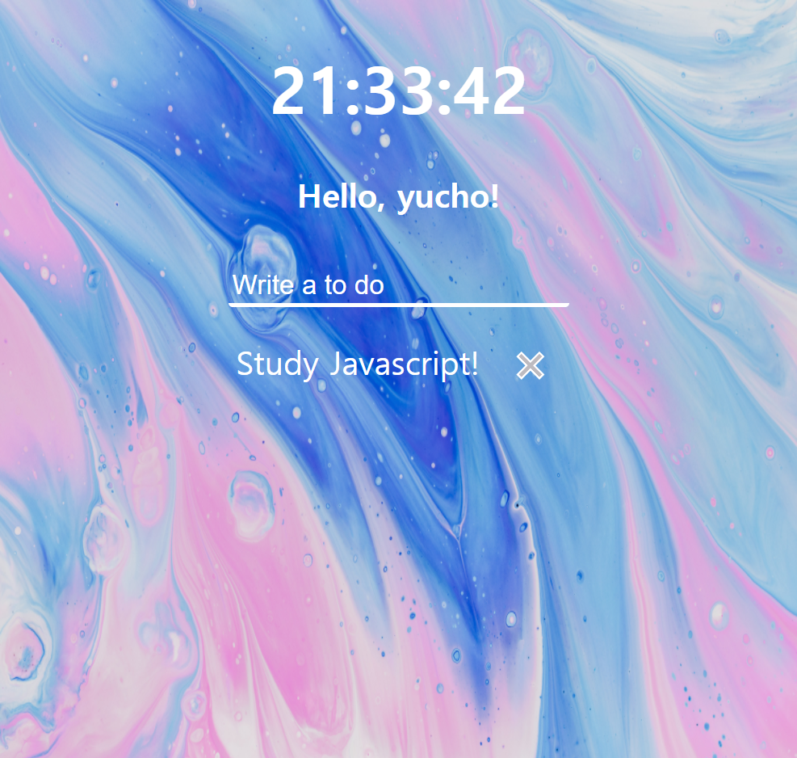

# Momentum

[Momentum](https://chrome.google.com/webstore/detail/momentum/laookkfknpbbblfpciffpaejjkokdgca) 과 [Vanilla JS - Nomad Coders](https://www.youtube.com/watch?v=FP9QEHzqwRM&list=PLm_ohmpwdqdZavpybKWCcWsUaaTCgv3gN) 를 참고하여 공부한 내용입니다.:sparkles: 

